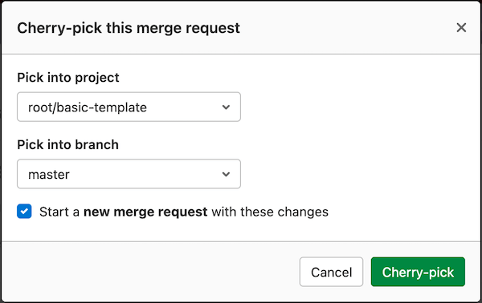

# Cherry-pick changes **(FREE)**

In Git, *cherry-picking* is taking a single commit from one branch and adding it
as the latest commit on another branch. The rest of the commits in the source branch
are not added to the target. You should cherry-pick a commit when you need the
change contained in a single commit, but you can't or don't want to pull the
entire contents of that branch into another.

You can use the GitLab UI to cherry-pick single commits or entire merge requests.
You can even cherry-pick a commit from [a fork of your project](#cherry-pick-into-a-project).

NOTE:
Support for tracking commits cherry-picked from the command line
is tracked [in this issue](https://gitlab.com/gitlab-org/gitlab/-/issues/202215).

## Cherry-pick example

In this example of cherry-picking, a Git repository has two branches: `develop` and `main`.
This example shows a cherry-picked commit from one branch being added to another:

```mermaid
gitGraph
 commit id: "A"
 branch develop
 commit id:"B"
 checkout main
 commit id:"C"
 checkout develop
 commit id:"D"
 checkout main
 commit id:"E"
 cherry-pick id:"B"
 commit id:"G"
 checkout develop
 commit id:"H"
```

In this example, a cherry-pick of commit `B` from the `develop` branch is added
after commit `E` in the `main` branch.

Commit `G` is added after the cherry-pick.

## Cherry-pick all changes from a merge request

After a merge request is merged, you can cherry-pick all changes introduced
by the merge request:

1. On the top bar, select **Main menu > Projects** and find your project.
1. On the left sidebar, select **Merge requests**, and find your merge request.
1. Scroll to the merge request reports section, and find the **Merged by** report.
1. In the upper-right corner, select **Cherry-pick**:

   
1. In the modal window, select the project and branch to cherry-pick into.
1. Optional. Select **Start a new merge request with these changes**.
1. Select **Cherry-pick**.

## Cherry-pick a single commit

You can cherry-pick a single commit from multiple locations in your GitLab project.

### From a project's commit list

To cherry-pick a commit from the list of all commits for a project:

1. On the top bar, select **Main menu > Projects** and find your project.
1. On the left sidebar, select **Repository > Commits**.
1. Select the [title](https://git-scm.com/docs/git-commit#_discussion) of the commit you want to cherry-pick.
1. In the upper-right corner, select **Options > Cherry-pick** to show the cherry-pick modal.
1. In the modal window, select the project and branch to cherry-pick into.
1. Optional. Select **Start a new merge request with these changes**.
1. Select **Cherry-pick**.

### From a merge request

You can cherry-pick commits from any merge request in your project, regardless of
whether the merge request is open or closed. To cherry-pick a commit from the
list of commits included in a merge request:

1. On the top bar, select **Main menu > Projects** and find your project.
1. On the left sidebar, select **Merge requests**, and find your merge request.
1. In the merge request's secondary menu, select **Commits** to display the commit details page.
1. Select the [title](https://git-scm.com/docs/git-commit#_discussion) of the commit you want to cherry-pick.
1. In the upper-right corner, select **Options > Cherry-pick** to show the cherry-pick modal.
1. In the modal window, select the project and branch to cherry-pick into.
1. Optional. Select **Start a new merge request with these changes**.
1. Select **Cherry-pick**.

### From the file view of a repository

You can cherry-pick from the list of previous commits affecting an individual file
when you view that file in your project's Git repository:

1. On the top bar, select **Main menu > Projects** and find your project.
1. On the left sidebar, select **Repository > Files** and go to the file
   changed by the commit.
1. Select **History**, then select the [title](https://git-scm.com/docs/git-commit#_discussion)
   of the commit you want to cherry-pick.
1. In the upper-right corner, select **Options > Cherry-pick** to show the cherry-pick modal.
1. In the modal window, select the project and branch to cherry-pick into.
1. Optional. Select **Start a new merge request with these changes**.
1. Select **Cherry-pick**.

## Cherry-pick into a project

> - [Introduced](https://gitlab.com/gitlab-org/gitlab/-/issues/21268) in GitLab 13.11 behind a [feature flag](../../feature_flags.md), disabled by default.
> - [Feature flag removed](https://gitlab.com/gitlab-org/gitlab/-/issues/324154) in GitLab 14.0.

You can cherry-pick merge requests from the same project, or forks of the same
project, from the GitLab user interface:

1. In the merge request's secondary menu, select **Commits** to display the commit details page.
1. In the upper-right corner, select **Options > Cherry-pick** to show the cherry-pick modal.
1. In **Pick into project** and **Pick into branch**, select the destination project and branch:
   
1. Optional. Select **Start a new merge request** if you're ready to create a merge request.
1. Select **Cherry-pick**.

## View system notes for cherry-picked commits

When you cherry-pick a merge commit in the GitLab UI or API, GitLab adds a [system note](../system_notes.md)
to the related merge request thread in the format **{cherry-pick-commit}**
`[USER]` **picked the changes into the branch** `[BRANCHNAME]` with commit** `[SHA]` `[DATE]`:


The system note crosslinks the new commit and the existing merge request.
Each deployment's [list of associated merge requests](../../../api/deployments.md#list-of-merge-requests-associated-with-a-deployment) includes cherry-picked merge commits.

## Related topics

- Use the [Commits API](../../../api/commits.md) to add custom messages
  to changes when you use the API to cherry-pick.

## Troubleshooting

### Selecting a different parent commit when cherry-picking

When you cherry-pick a merge commit in the GitLab UI, the mainline is always the
first parent. Use the command line to cherry-pick with a different mainline.

Here's a quick example to cherry-pick a merge commit using the second parent as the
mainline:

```shell
git cherry-pick -m 2 7a39eb0
```
